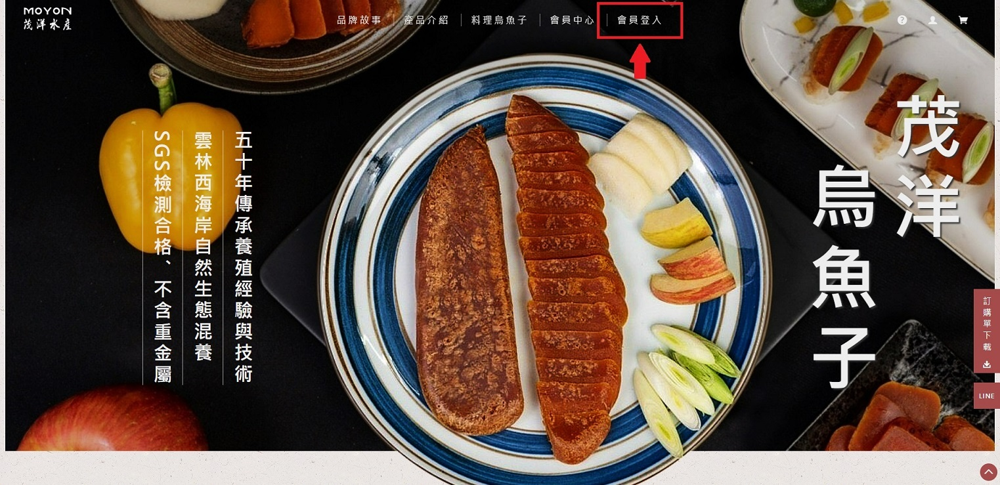
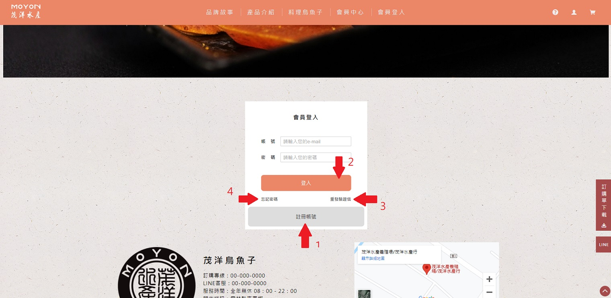
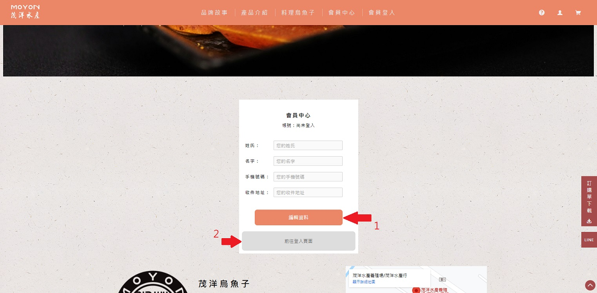

  
  <h2 align="center">SpringBoot_RESTful_API</h2>

  
  

    <a href="http://reactjsonlinestorefrontend-env.eba-3pthpit7.ap-northeast-1.elasticbeanstalk.com/">網站入口</a>
  

## Description

烏魚子網站的後端 RESTful API，提供會員註冊、信箱驗證、會員登入、編輯會員資料、重設密碼等功能。
語言為 Java，框架為 SpringBoot，透過 GitHub Actions 以 Docker 容器部署到AWS上。

## How to use

**第一步：會員註冊、登入**

  

進入首頁，點擊導覽列中的會員登入

  

功能說明：
1. 註冊
2. 登入(需通過信箱驗證後才可登入)
3. 重發信箱驗證信
4. 重設密碼

 

**第二步：設定會員資料**

  

功能說明：
1. 點擊後可開始編輯資料，擊點第二次可保存資料
2. 前往登入頁面

